# Internship Management System – Uva Wellassa University

An online web-based platform designed to automate and streamline the internship process for the Department of Computer Science & Technology, Uva Wellassa University.
This system connects students, companies, academic supervisors, industrial supervisors, and the internship coordinator into a single integrated workflow, 
improving communication and reducing administrative workload.
The main purpose of this project is to reduce the workload of the internship coordinator and students and make the internship training process more efficient 
through effective communication.

---

## Features

### Students
- Create and manage personal profile  
- Upload CV and profile photo  
- Select internship preferences  
- View interview schedules  
- Receive selection results  
- Submit progress reports  

### Companies
- View student profiles and CVs  
- Select students for interviews (Drag & Drop interface)  
- Schedule interview date & time  
- Conduct interviews via video conferencing  
- Create marking schemes  
- Provide marks and feedback  
- Send final selection results  

### Academic & Industrial Supervisors
- Review student progress reports  
- Provide feedback and remarks  

### Internship Coordinator
- Create default user accounts  
- Assign academic supervisors  
- Manage companies and student records  
- Monitor system-wide activities  

---

##  Technology Stack

- **Backend:** PHP  
- **Database:** MySQL  
- **Frontend:** HTML, CSS, JavaScript, jQuery, AJAX  
- **UI Components:** jQuery UI  
- **Development Environment:** WAMP Server  

---

## System Requirements

### Hardware
- Pentium 4 or above  
- 512 MB RAM or higher  
- 20 GB HDD  
- 32 MB VGA  

### Software
- WAMP Server 2.1e or above  
- PHP 5.3+  
- MySQL 5.5+  
- Web Browser (Chrome / Firefox recommended)  

---

## Installation Guide

### Install WAMP Server
Download and install WAMP Server on your system.

### 2️Copy Project Files
Move the project folder into:C:\wamp\www\

### Create Database
- Open browser: `http://localhost/phpmyadmin`
- Create database: `ims`
- Import the SQL file located in `/database/ims.sql`

### Run the Project
Open browser and visit: http://localhost/InternshipManagementSystem/

---
## Project Structure
InternshipManagementSystem/
│
├── config/ # Database configuration
├── controllers/ # PHP controllers
├── models/ # Database models
├── views/ # UI pages (PHP/HTML)
├── assets/
│ ├── css/
│ ├── js/
│ └── images/
├── uploads/
│ ├── cv/
│ └── photos/
├── database/
│ └── ims.sql
├── screenshots/
│ └── (UI images)
├── index.php
└── README.md

---

## Screenshots
screenshots inside `/screenshots` folder 

### Login Page
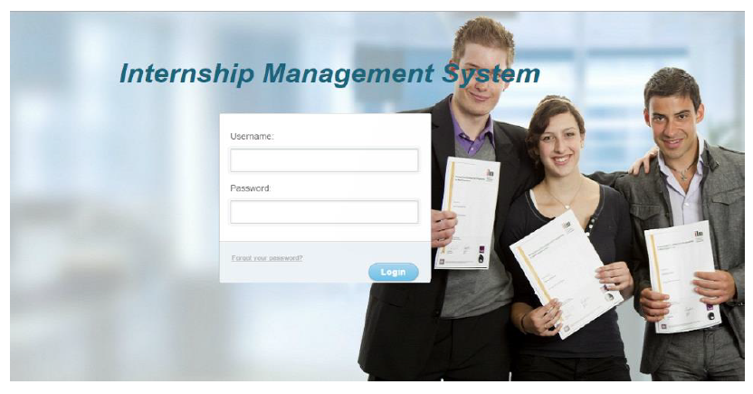

---

### Dashboard
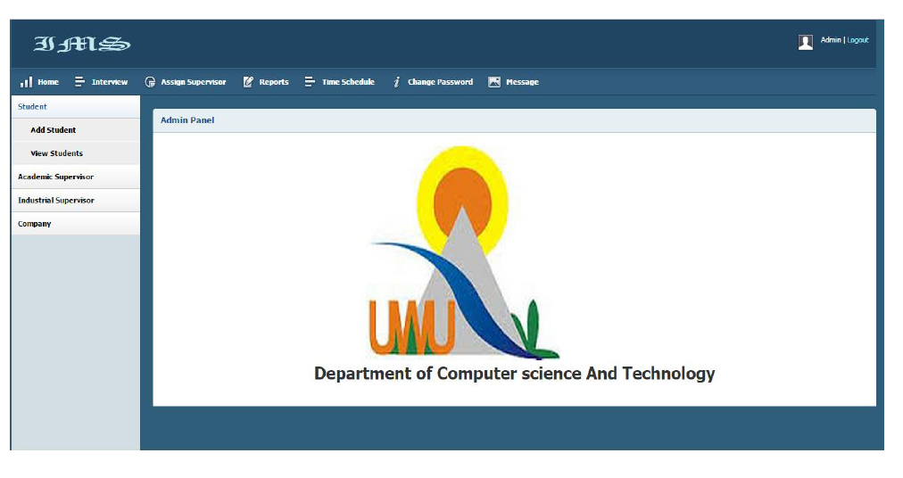

---
### Add Student
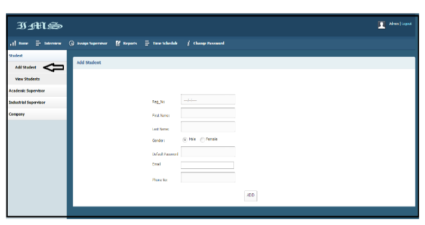

### Edit Student Details
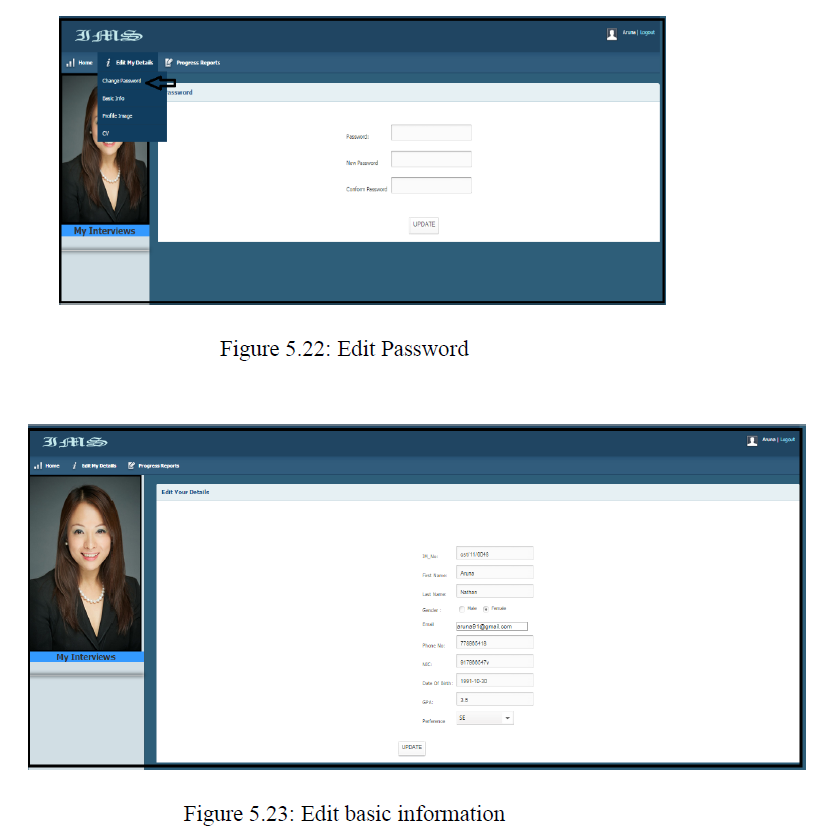

### Add Academic Supervisor
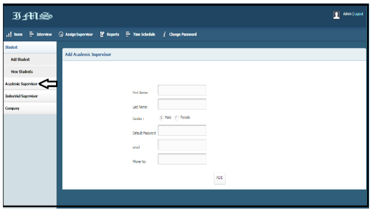

### Add Company
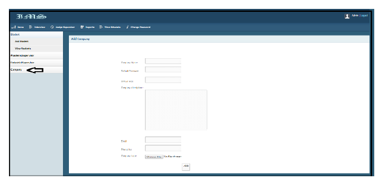

### Select Students
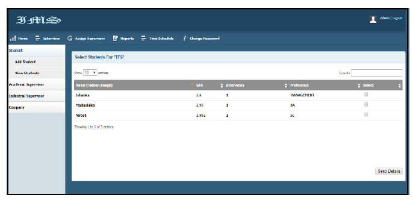

### Select Company
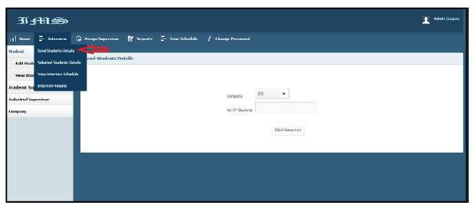

### Fix Interview Date & Time
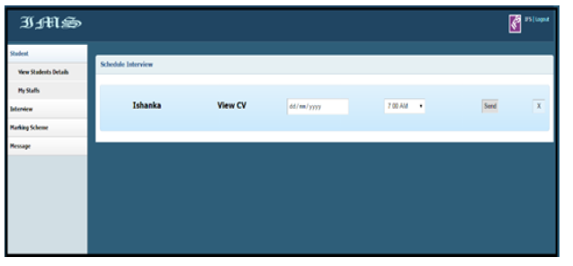

### Interview Schedule (Grouped by Company)
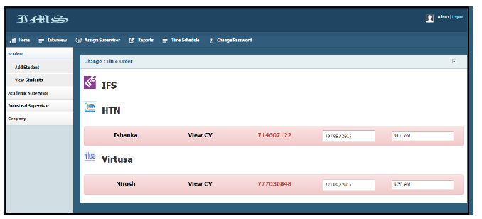

### Create Marking Scheme
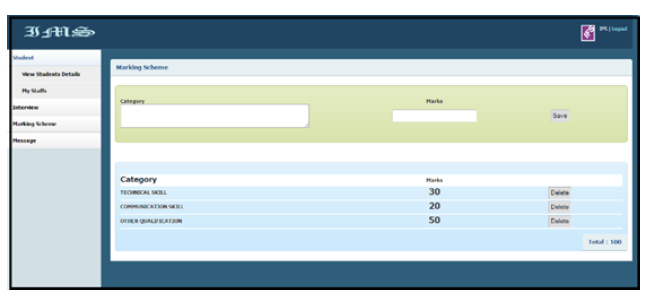

### Final Selection Results
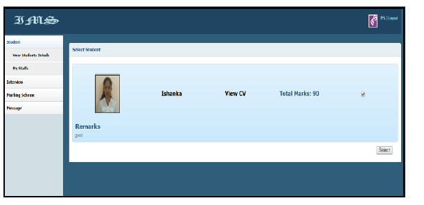

### Select Supervisor
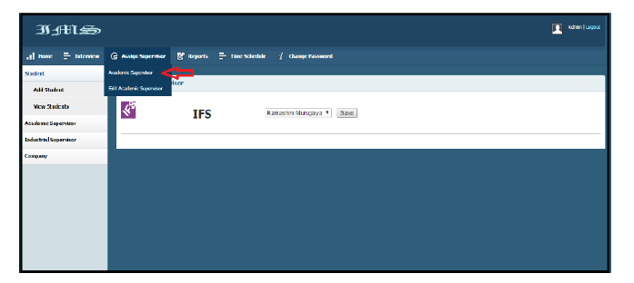

### Send Progress Report
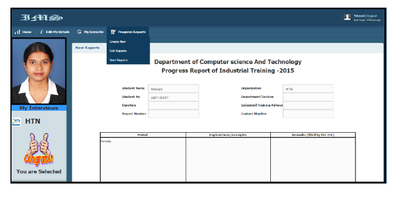

### Provide Marks & Remarks
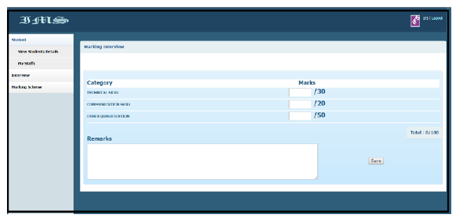

### Send Private Message
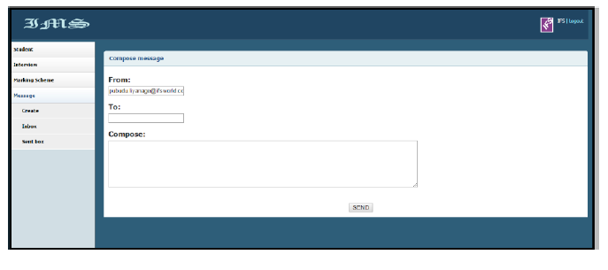

---

## Testing & Evaluation

The system was tested using:

- White-box testing during development  
- Black-box testing after module integration  

### Focus Areas:
- Security  
- Accuracy  
- Reliability  
- Usability  

---

## Future Improvements

- Mobile-responsive UI  
- Real-time notifications  
- Improved supervisor-student communication  
- Advanced automation features  
- Cloud deployment  

---

## License

This project was developed as part of the **BSc in Computer Science & Technology** program at **Uva Wellassa University**.

---

## Author

Sriarani Surenther  
GitHub: https://github.com/sriarani16  
LinkedIn: https://www.linkedin.com/in/sriarani-surenther  

